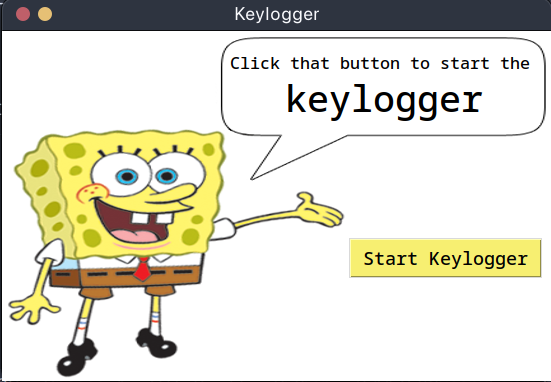
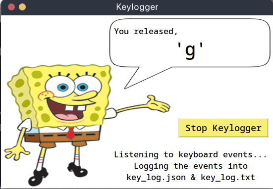
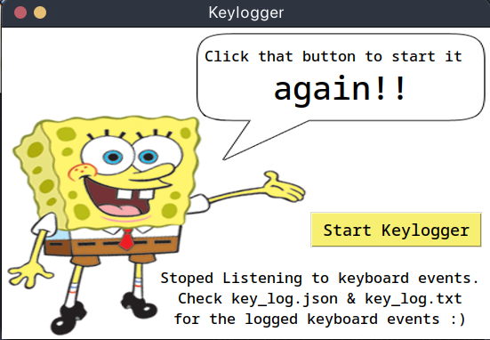

# Keylogger

Simple keylogger application implemented in Python using Tkinter for the GUI and pynput for capturing keyboard events.

## Screenshots
<div style="display:flex; gap: 5px">
    
    
    
</div>


## To Run this keylogger

```bash
# Clone this Repository
git clone https://github.com/satz1230/keylogger.git
cd keylogger

# Create venv and install dependencies
python -m venv myenv
source myenv/bin/activate
pip install -r requirements.txt

# Run the script
python keylogger.py
```


